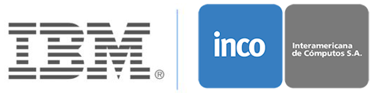

# Implementando OpenId y SSO en Datapower

# Laboratorio 1 - OIDC con proveedor Interno de identidades

En este laboratorio crearemos y configuraremos los objetos de datapower para brindar autenticación de credenciales de usaurio usando conectores de OpenID. La validación de la credencial se hará contra un proveedor interno, para este ejercicio las credenciales están almacenadas en el mismo datapower.

## Pasos del laboratorio

Empecemos!

**Paso 1** Acceder a la consola de gestión de DataPower

1. En la vm de trabajo, abrimos una ventana de firefox y accedemos a la cónsola de administración de datapower en https://datapower:9090

Las credenciales de acceso:

  * Usuario __student__
  * password __Passw0rd__
  * Domain __student__

**Paso 2** Registrar cliente OIDC para interactuar con el proveedor de identidades

1. En el menú de la consola de datapower, en el campo de búsqueda, colocamos __OAuth Client Profile__
2. Pulsamos el botón [New]
3. Llenamos el formulario de acuerdo a la imagen abajo. Importante, la opción __openID Connect__ debe estar marcada y __Enforcement point for resource Server__ desactivada

4. En la sección __Authorization and Token Endpoints__, deseleccionamos  __Generate Client Secret__ y llenamos la información tal como se indica en la siguiente imágen

5. Al presionar el (+) en __ID token JWT generator__, tendremos un nuevo formulario para generar nuestro JSON Web Token para nuestro profile. Llenamos los valores del formulario ta como se coloan en la imagen

**Paso 3** Crear y configurar grupo de OAuth para el cliente

1. En el menú de la consola, colocamos en la búsqueda __OAuth Client Group__

2. Creamos un nuevo grupo pulsando el botón [New]

3. Llenamos los datos del formulario tal como se desribe en la siguiente imagen

**Paso 4** Crear un servicio de Web token para que actúe como un proveedor de OIDC

1. Desde el menú de la consola, en el campo de búsqueda, colocamos __Web Token Service__

2. Creamos un nuevo servicio presionando el enlace [New]

3. En este paso crearemos nuestro proveedor de identidad usando OIDC. Para ello, llenamos el formulario con la siguiente información

4. Se puede observar que en el campo __Processing Policy__ se encuentra abajo. Pulsaremos el lápiz para terminar de configurar la política de procesamiento.

5. Pulsaremos la política __oidc-provider-rule-2__ para configurar la política AAA para usar OIDC.

6. Modificamos la política AAA pulsando el lápiz

7. Configuramos la fase de extracción marcando los flags de __HTTP Authentication header__ y __OAuth__ quedando como la siguiente imagen y pulsamos [Next]

8. Configuramos la fase de autenticación usando a Datapower como repositorio de identidades. Para ello usaremos un archivo de credenciales llamado __ibmair_aaa.xml__ y pulsamos [Next]

9. Configuramos como obtener los recursos procesando la metadata de __OAuth y pulsamos [Next]

10. finalizamos la configuración haciendo las siguiente configuración
* Dejamos la parte de autorización en __Allow any authenticated client__
* Pulsamos [Next]
* Dejamos todos los valores predefinidos y pulsamos [Commit]

11. Aplicamos los cambios en nuestra política pulsando [Done] en los dos diálogos y luego, en la pantalla de políticas de procesamiento, pulsamos [Apply] y [Close window]

Terminamos de configurar el back bone para procesar peticiones OIDC y emplear OAuth para la autenticación de usuarios. Ahora, publicaremos nuestra configuración a través de un miltiprotocolo

**Paso 5** Revisar política de login social

1. Configuramos nuestra polític de login social, para ello en la consola de datapower, colocamos en el campo de búsqueda __Social Login Policy__

2. Por temas de tiempo, la política se encuentra creada, accederemos a ella y haremos una vistada de la configuración

**Paso 6** Crear y configurar servicio multiprotocolo para peticiones de OIDC

Nos prepararemos para publicar nuestro servicio a través de un multiprotocol gateway.

1. En el menú de la consola de datapower, en el campo de búsqueda colocamos __Multi-protocol Gateway__ y presionamos [New]

2. Configuramos nuestro multiprotocolo siguiendo estos Pasos
* __Name__: `social-login-Service`
* __URL__: `http://127.0.0.1:2090/`
* En la sección __Proxy Settings__
  * __Request type__: `Non-XML`
  * __Response type__: `Non-XML`
* Regresamos a la sección principal y en __Front side protocol__ pulsamos el botón [Add]

3. Configuramos el front side handler de la siguiente formulario

4. En la sección principal, creamos una nueva política de procesamiento
* __Policy name__: `social-login`
* Creamos una nueva regla, seleccionando la dirección `Client to server`
  * Configuramos la acción match en `All`
  * Agregamos una acción AAA como se muestra en las siguientes imágenes. Al terminar, agregaremos una acción `Result` para cerrar la regla

  

  

  

  

* Crearmos una nueva regla, seleccionando la dirección `Server to Client`
  * Configuramos la acción match en `All`
  * Anexaremos una acción GatewayScript para procesar el token de retorno de nuestro servicio de OIDC. Esto lo hacemos para presentarlo en el repsonse en formato JSON.

  

  

Guardamos todos los cambios y verifiquemos que el servicio esté arriba.

**Paso 7** Probar desarrollo

Ahora a ver como nuestro proveedor de identidades funciona usando nuestro OIDC.

1. Abrimos una nueva pestaña en firefox
2. Colocamos la siguiente url `https://ibmair.ibm.com:2092/test`
3. Se nos presentará un diálogo para colocar las credenciales de acceso

* __User Name__: `david`
* __Password___ `passw0rd`
4. Seleccionado `Allow access` y listo!

Debera ver una pantalla parecida a esta, donde se detalla la información del token recibido

## Resumen y siguiente laboratorio

* Construimos una configuración de OAuth para dar soporte a nuestro OIDC
* Construimos las políticas de uso de nuestro conector de OpenId
* Construimos un proveedor de OpenID
* Publicamos nuestro servicio en DataPower

Ahora, usaremos un proveedor externo en nuestro [laboratorio 2](../Lab%202%20-%20OIDC%20proveedor%20externo/README.md)
