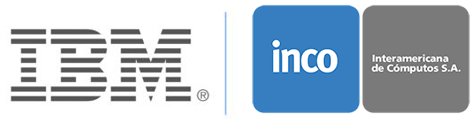
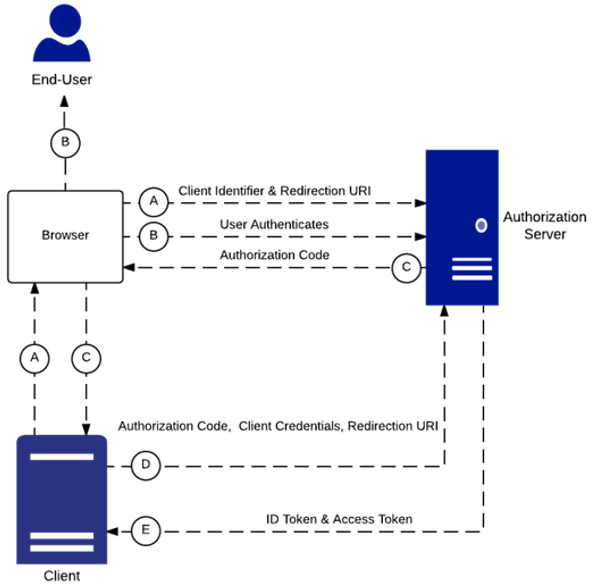

# Implementando OpenId y SSO en Datapower

Convertir a Datapower en un proveedor de conectores OpenId para Federación de identidades internas y externas

---

## Descripción del taller

El objetivo del taller es conocer las capacidades de Autenticación y Autorización utilizando OpenId para proveedor de identidad interno y externo (Google)

__Nivel de experiencia__: Principiante

__Duración__: 1 hora

__Requisitos__: Instancia de Datapower (Reservar instancia en: https://www.ibm.com/demos/collection/IBM-DataPower-Gateway/?lc=en#demo-environment)

## Introducción a OpenId Connect (OIDC)

OpenID Connect es un protocolo de autenticación interoperable basado en la familia de especificaciones OAuth 2.0. Utiliza flujos de mensajes REST / JSON con el objetivo de diseño de "hacer posibles las cosas simples y las cosas complicadas". Es excepcionalmente fácil de integrar para los desarrolladores, en comparación con cualquier otro protocolo de identidad.

OpenID Connect permite a los desarrolladores autenticar a sus usuarios en sitios web y aplicaciones sin tener que poseer y administrar archivos de contraseña. Para el creador de aplicaciones, proporciona una respuesta segura y verificable a la pregunta: "¿Cuál es la identidad de la persona que actualmente usa el navegador o la aplicación nativa que está conectada a mí?"

OpenID Connect permite que clientes de todo tipo, incluidos JavaScript basados ​​en navegador y aplicaciones móviles nativas, inicien flujos de inicio de sesión y reciban afirmaciones verificables sobre la identidad de los usuarios registrados.

__(Identidad, Autenticación) + OAuth 2.0 = OpenID Connect__

*Flujo de autenticación usando OIDC*

Mas información en https://openid.net/connect/faq/

## Laboratorio 1 - OIDC proveedor interno

Vamos a convertir a Datapower en un punto de conexión de OpenId para autenticar un usurio y generar su token de acceso para interactuar con los servicios de backend que queramos proteger.

Si es la primera vez que accedes a los ambientes de IBM Skytap para los ambientes de demostración, accede a [HowTo - Acceso al ambiente.md](HowTo%20-%20Acceso%20al%20ambiente.md) para el proceso de preparación del ambiente

__Resumen del laboratorio__:

1. Acceder a la consola de gestión de DataPower
2. Registrar cliente OIDC para interactuar con el proveedor de identidades
3. Crear y configurar grupo de OAuth para el cliente
4. Crear un servicio de Web token para que actúe como un proveedor de OIDC
5. Revisar política de login social
6. Crear y configurar servicio multiprotocolo para peticiones de OIDC
7. Probar desarrollo

Accede al paso a paso [en este link](Lab%201%20-%20OIDC%20proveedor%20Interno/README.md)

## Laboratorio 2 - Google como proveedor externo de identidades

Ahora utlizaremos cuentas de Google para autenticar e identificar a los usuarios que consumen nuestro servicios desde Datapower.

__Pasos del laboratorio__

1. Acceder a la consola de gestión de DataPower
2. Registrar a datapower como cliente de OIDC de Google
3. Crear y configurar servicio de multiprotocolo para peticiones de OIDC
4. Crear y asociar política de login social
5. Crear un cache de certificado de OAuth para mejor performance
6. Probar desarrollo

## Resumen ##

Configurando servicios de OIDC en Datapower nos habilitan a poder concentrar la identificación de usuarios que acceden a aplicaciones o servicios. Esta estrategia evita recodificar en cada aplicación o servicio las políticas de AAA definidas y poder tener diversos mecanismos dependiendo de los consumidores finales.
